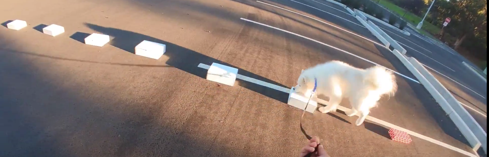

# snoot-scoop

**snoot-scoop** is my data project focused on summarizing and drawing insights from NACSW scent work trial results data. My goal is to explore the data using ggplot, tidyverse and related packages from the R ecosystem as taught by the [R4DS Online Learning Community](https://www.rfordatasci.com/) and [TidyTuesday](https://github.com/rfordatascience/tidytuesday) projects.

 

# Context
[National Association of Canine Scent Work, LLC (NACSW)](https://www.nacsw.net/about-us-0) is an organization in the US that arranges well-structured and engaging canine scent detection competitions. Think a for-fun competition version of the kind of work a sniffer dog does when they're screening luggage at an airport.

Dogs competing in NACSW are trained to detect 3 target odors - Birch, Anise and Clove. At the trials, cotton swabs or similar items scented with one or more of these odors are hidden out of view. The dogs must source the locations of the hides and indicate to their handler who reports the find to the judge. If the team correctly sources a hide, they earn points for it. 

Teams work in diverse environments (referred to as **elements**) searching for hides in indoor locations, outdoor locations, on vehicles and in containers. The number of hides, search area sizes and complexity of the scent puzzles the teams encounter increases with increasing levels of competition. At higher levels of competition teams also encounter unknown number of hides including unknown no hides (blank areas).

# Dataset

The dataset that was analyzed consists of the results of NACSW NW1, NW2, NW3, Elite, Summit, L1, L2 & L3 trials from 2009 through 2021. It was obtained by scraping the results posted at NACSW's [trial results page](https://www.nacsw.net/trial-results).

NACSW's full trial rule book is [available here](https://www.nacsw.net/trial-information/trial-rule-book) and can be used as a reference in understanding how the scores, times, faults, errors in the results data translate into pass/fail results, titles, high-in-trial and other placements. The rule book also provides more information on the different elements.

# Data Exploration

<ul>
  
    <li>
      <a href="{{ post.url | relative_url }}">{{ post.title }}</a>
    </li>
  
</ul>

# TODO
- Exploration: 
  - Does success in any one element correlate with success in another element? 
- Prediction:
  - What states will next year's NW1 overall high placing dogs earn their titles from? 
  - What new breed might feature amongst Summit dogs in the next 5 years?
  - What new breed mix would make a great scent work dog?

# Acknowledgement

Thank you, NACSW for making this trove of historical scent work data available publicly to the trial competitors and fans of this dog sport and venue.

